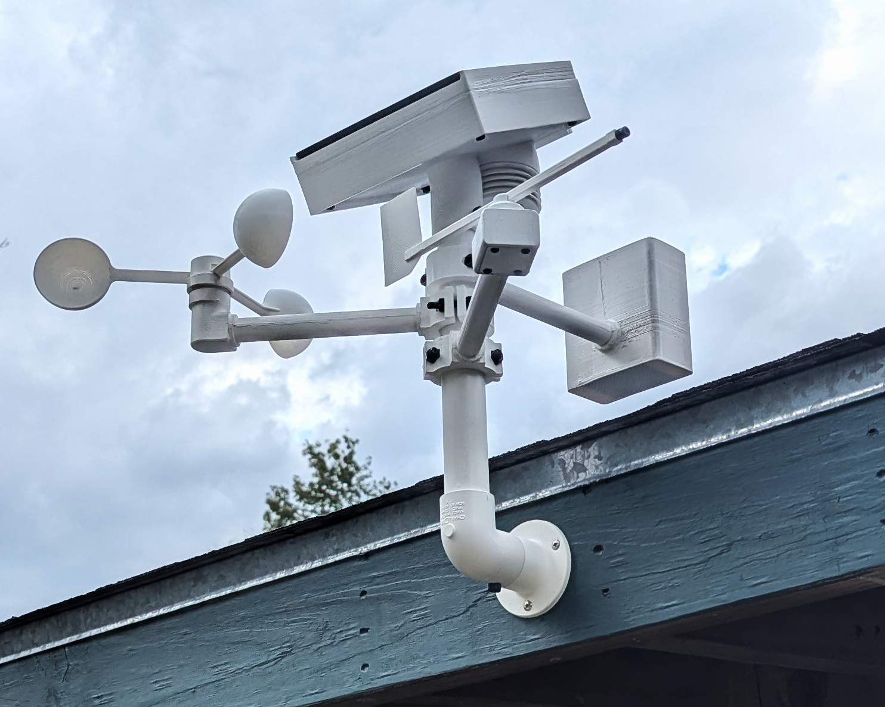

# EchoWeather: DIY weather station and app (WIP)
A personal project to design, build, and program a working weather station that connects to a database and smart phone app. Collected data will then be used to train an AI model that will predict future weather variables.

## Weather Variables

* Wind Speed
* Wind Direction
* Temperature
* Humidity
* Pressure
* Ambient Light
* UV Light
* Rain

## Sensors and Components
1. XIAO ESP32C3: https://www.amazon.com/dp/B0DGX3LSC7?ref=ppx_yo2ov_dt_b_fed_asin_title&th=1
2. BME280 breakout module: https://www.amazon.com/dp/B0DHPCFJD6?ref=ppx_yo2ov_dt_b_fed_asin_title&th=1
3. AS5600 Magnetic Encoder: https://www.amazon.com/dp/B094F8H591?ref=ppx_yo2ov_dt_b_fed_asin_title&th=1
4. TP4056 Lithium Battery Charging Module: https://www.amazon.com/dp/B098989NRZ?ref=ppx_yo2ov_dt_b_fed_asin_title
5. LTR390-UV Ultraviolet Sensor: https://www.amazon.com/dp/B0CHJL143Z?ref=ppx_yo2ov_dt_b_fed_asin_title&th=1
6. VEML7700 Ambient Light Sensor: https://www.amazon.com/dp/B09KGYF83T?ref=ppx_yo2ov_dt_b_fed_asin_title
7. 6V3W Waterproof Solar Panel: https://www.amazon.com/dp/B0CS364JGG?ref=ppx_yo2ov_dt_b_fed_asin_title&th=1

## Modules
The weather station will be built in 4 modules.
1. Power and basic variables (Main module)
2. Wind vane
3. Anemometer
4. Rain gauge

Each module will be connected together to the main module where all collected data will be sent to the cloud.

## Power
The station will be powered by two 18650s in parallel. To keep the battery charged, the station will have a built in 6V3W solar panel that charges the battery through a TP4056 charging module.

## Materials
Most of the station is printed with PETG which should be able to withstand fairly high outdoor temperatures and resist fading or cracking. 1" PVC pipe is used for the main support to hold each module of the station. For extra UV protection a few coats of white spray paint will be used.

## Code
Download full code folder and make sure to replace the credentials in cred.h with your own information for WiFi and google sheet connectivity. Read this article for getting IDs and keys for the credentials: [https://randomnerdtutorials.com/esp32-datalogging-google-sheets/].

## App
The app was designed in MIT App Inventor and I have included the .aia file that you can import into App Inventor and configure to your project. (the only required configuration is the URL to your app script for sheets, re: docs/Google_sheet_setup).

## Calibration (WIP)
I am still in the process of calibrating the sensor, some values make little sense such as the UV levels. After enough data is collected I will upload a new arduino sketch with the updated calibration values. 

